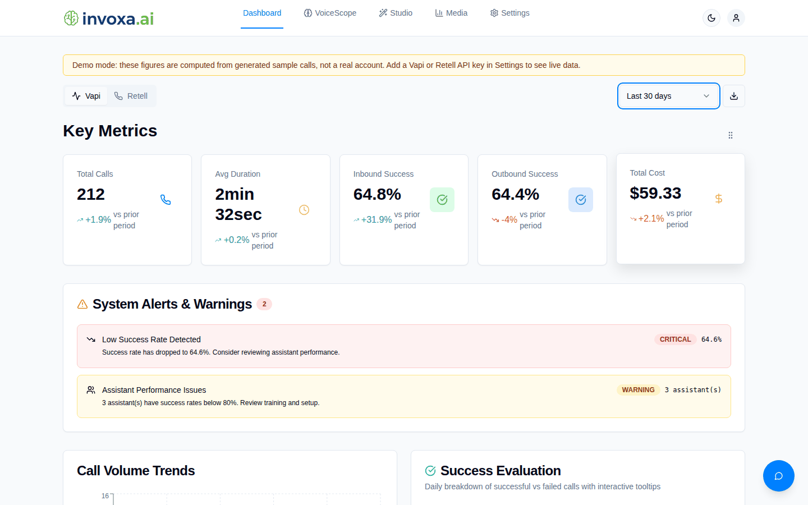
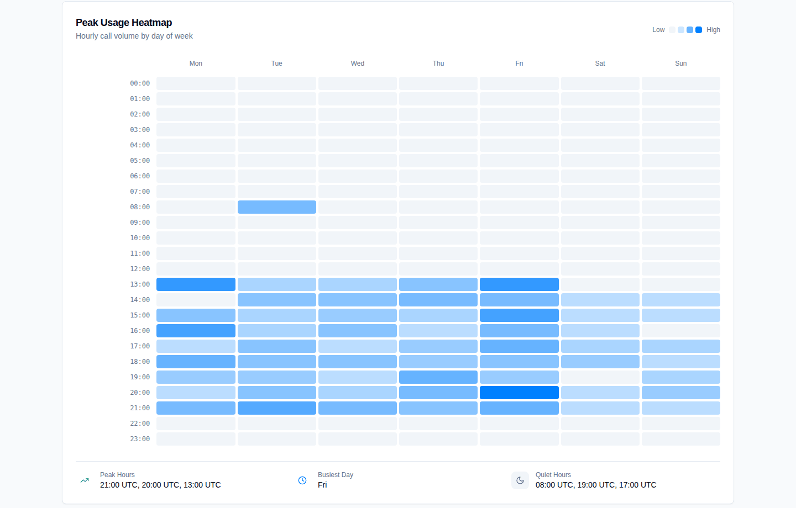
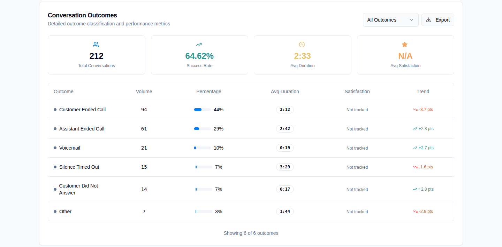

# Invoxa (vapi-analytics)

Call analytics dashboard for voice AI agents built on [Vapi](https://vapi.ai) and [Retell](https://www.retellai.com).

Each customer workspace connects its own Vapi and/or Retell API key. The server pulls the raw call records for the selected period and computes everything on the dashboard from them: KPIs with period-over-period comparison, daily volume and success, outcome breakdown, duration distribution, a peak-usage heatmap, per-assistant performance, and cost per call and per minute. A demo mode with seeded sample calls lets you explore the dashboards without any provider keys.



| Peak usage heatmap | Conversation outcomes |
| --- | --- |
|  |  |

Screenshots show demo mode with generated sample calls, not a real account.

## Features

Working today:

- **Accounts and tenancy:** JWT auth, invite-only signup (email whitelist), email verification, per-customer workspaces, and super-admin screens for customers, users and the whitelist.
- **Analytics dashboard** (`/dashboard`) for Vapi and Retell. Figures come only from the provider's call records for the period:
  - totals, average duration, success rate (overall, inbound, outbound) and cost, each compared with the previous period of the same length
  - daily volume and success/failure, outcome (ended reason) shares and their change vs the previous period, average duration per outcome
  - duration histogram, peak-usage heatmap (UTC), per-assistant calls/success/duration/cost, most successful assistant (minimum 5 calls)
  - configurable warning thresholds, CSV export, drag-to-reorder sections
- **Call browser:** recent calls and per-call details (Vapi call details include the recording URL).
- **Demo mode:** `DEMO_MODE=true` plus `npm run db:seed-demo` gives a login with roughly 660 clearly labeled sample calls across both providers.
- **Marketing site:** public landing, solutions, use-case, platform, privacy and terms pages.

- **Assistant Studio** (`/assistant-studio`): lists, creates, updates and deletes assistants on the workspace's own Vapi account. Demo workspaces see read-only sample assistants. Tenant isolation is covered by tests; the Vapi API itself is mocked.

Present but needing extra keys, and only partly covered by tests:

- **VoiceScope** (`/bulk-analysis`): natural-language questions over up to 50 selected call transcripts, answered by OpenAI.
- **AI generation in Assistant Studio and the dashboard chatbot** (OpenAI).
- **Reports, benchmarks and conversation-flow analysis** API endpoints (OpenAI plus the workspace's own Vapi key). These have no UI yet.
- **Media** (`/media`): Facebook Ads campaign insights (Facebook app credentials entered per workspace).

Without `OPENAI_API_KEY` the AI features return `503 OPENAI_NOT_CONFIGURED` and the UI says the feature is not configured; everything else keeps working.

Not implemented yet:

- Customer satisfaction scores. Neither provider reports them, so the dashboard shows "Not tracked".
- Stage-level conversation flow on the dashboard. That section says so when there is no data.

## How the numbers are computed

`server/analytics/dashboard.ts` holds the aggregation as pure functions with unit tests:

- **Data source:** Vapi and Retell calls are normalized into one `NormalizedCall` shape (`server/providers/calls.ts`): durations in seconds, cost in USD, inbound or outbound, and `successEvaluation` taken from the provider's call analysis.
- **Success:** a call counts as successful when its `successEvaluation` is `true`. Calls on assistants with no success evaluation configured count as unsuccessful.
- **Comparisons:** each request loads the current period and the previous period of the same length. `costAnalysis.monthlyCostTrend` is the percentage change in total cost between them, and is `null` when there is no previous-period baseline.
- **Fetch cap:** each request fetches at most 1,000 calls per period, a provider API limit. When a period hits the cap, the response sets `meta.callLimitReached` and the dashboard shows a notice.
- **Retell aggregates:** Retell has no aggregation API, so `POST /api/analytics` computes the same `kpis` / `call_outcomes` / `assistant_performance` shape from raw calls.

## Architecture

```
client/            React 18 + Vite, wouter routing, TanStack Query, shadcn/ui + Tailwind, Recharts
server/
  index.ts         Express app (helmet, CORS, logging), Vite dev middleware or static serving
  routes/          One module per domain: auth, customer, admin, analytics, calls,
                   bulk-analysis, voicescope, benchmarks, assistants, conversation-flow,
                   chatbot, facebook-ads; registered from routes/index.ts
  analytics/       Pure aggregation (dashboard.ts) and Vapi Analytics API queries
  providers/       Vapi/Retell clients and normalization; source.ts picks live vs demo data
  demo/            Deterministic sample-call generator
  email/           Pluggable email sender (Resend over HTTP, or console)
  providers/tenant.ts  Resolves the signed-in customer's own provider key (never a platform key)
  security/        AES-256-GCM secret encryption, one-time security migration
  config.ts        Production secret checks (fail fast)
  storage.ts       Drizzle data access (Postgres); encrypts/decrypts provider keys
shared/schema.ts   Drizzle tables + zod schemas shared by client and server
scripts/           seed-demo.ts, security-migrate.ts
tests/             Vitest: unit tests plus HTTP-level tenant isolation tests (mocked storage and provider APIs; no network, no database)
```

Production build: Vite bundles the client into `dist/public`, and esbuild bundles the server into `dist/index.js`. `render.yaml` is a Render blueprint.

## Setup

Requirements: Node 20+ (CI uses 22) and PostgreSQL.

```bash
npm install
cp .env.example .env          # set DATABASE_URL, JWT_SECRET, ENCRYPTION_KEY
npm run db:push               # create tables with drizzle-kit
npm run dev                   # http://localhost:5000
```

`npm run dev` does not load `.env` automatically. Export the variables in your shell, or use a tool like `dotenv-cli`.

### Try it with demo data (no Vapi/Retell keys)

```bash
export DATABASE_URL=postgres://...
npm run db:push
npm run db:seed-demo          # prints the login; re-run any time to refresh dates
DEMO_MODE=true npm run dev
```

Log in at `/login` as `demo@example.com` with password `demo-password-1`. You can override both with `DEMO_EMAIL` and `DEMO_PASSWORD`. Demo data is only served to workspaces with no key for the selected provider, and the dashboard shows a "Demo mode" banner while it is active.

### Signing up real users

Signup is invite-only: a super admin adds the address to the email whitelist first. With `RESEND_API_KEY` set, a verification link is emailed through Resend. Without it, the email is logged to the server console. Outside production, the signup response also includes the token so you can verify locally.

## Environment variables

| Variable | Required | Purpose |
| --- | --- | --- |
| `DATABASE_URL` | yes | Postgres connection string |
| `JWT_SECRET` | yes in production | Signs auth tokens. 32+ characters; the server will not start in production if it is missing or a placeholder |
| `ENCRYPTION_KEY` | yes in production | Encrypts stored Vapi/Retell keys and Facebook credentials. Same rules as `JWT_SECRET`; changing it makes stored keys unreadable |
| `PORT` | no | Defaults to 5000 |
| `TRUST_PROXY` | no | Express `trust proxy` value so rate limits see the real client IP. Defaults to `1` in production |
| `APP_URL` | recommended | Base URL for links in verification emails |
| `DEMO_MODE` | no | `true` serves seeded sample calls to workspaces without provider keys |
| `RESEND_API_KEY`, `EMAIL_FROM` | no | Send verification email through Resend; otherwise it is logged |
| `OPENAI_API_KEY` | for AI features | VoiceScope, Assistant Studio generation, reports, chatbot |
| `FACEBOOK_APP_SECRET`, `FACEBOOK_API_VERSION` | for `/media` | Facebook Ads integration |
| `JWT_EXPIRES_IN` | no | Token lifetime, default `24h` |

Customer Vapi and Retell keys are entered per workspace in Settings (or by a super admin when creating a customer). They are encrypted in the database and every Vapi/Retell request uses the workspace's own key. There is no platform-wide Vapi key; a `VAPI_API_KEY` variable from older setups is ignored.

## Scripts

| Script | What it does |
| --- | --- |
| `npm run dev` | Dev server with Vite HMR |
| `npm run build` | Client and server production build into `dist/` |
| `npm start` | Run the production build |
| `npm run check` | TypeScript typecheck |
| `npm test` | Vitest: aggregation, provider normalization, email, demo data, tenant isolation, crypto, config, migration |
| `npm run db:push` | Sync the Drizzle schema to the database |
| `npm run db:seed-demo` | Create or refresh the demo login and sample calls |
| `npm run db:security-migrate` | One-time: rehash legacy plaintext passwords and encrypt stored provider keys (see Security) |

CI (`.github/workflows/ci.yml`) runs typecheck, tests and build on every push and pull request.

## Security

What is in place:

- **Tenant isolation for provider accounts.** Every Vapi/Retell call made for a customer uses that workspace's own stored key, resolved server-side from the user's workspace assignment (`server/providers/tenant.ts`). Assistant and call IDs are format-checked before they go into a provider URL, and update/delete first confirm the assistant exists on the caller's own account. `tests/tenant-isolation.test.ts` runs the real routes against a fake Vapi API and checks that customer A cannot read, update or delete customer B's assistants or calls, cannot switch workspaces with `?customerId`, and that no request ever carries a platform key.
- **Stored keys.** Vapi and Retell keys are encrypted at rest with AES-256-GCM (`server/security/secrets.ts`) and only ever returned masked to the last four characters (`••••abcd`). Facebook credentials are encrypted too and are not echoed back by any route.
- **Passwords.** bcrypt (cost 12) only. Unknown emails still run a bcrypt comparison so response time does not reveal which accounts exist.
- **Secrets at startup.** In production the server exits if `JWT_SECRET` or `ENCRYPTION_KEY` is missing, shorter than 32 characters, or a known placeholder.
- **Authorization.** Customer routes require a verified user plus a workspace assignment check; admin routes require `super_admin`. Logout invalidates earlier tokens.
- **Input and abuse limits.** zod validation on mutating routes, per-IP rate limits on login/signup/verification/password change (in memory, per process), request rate limits on the paid AI and provider routes, helmet CSP.

### Upgrading an existing database

Earlier versions accepted plaintext passwords at login and stored provider keys unencrypted. Login no longer accepts plaintext, so run this once after deploying (same `DATABASE_URL` and `ENCRYPTION_KEY` as the app):

```bash
npm run db:security-migrate -- --dry-run   # report what would change
npm run db:security-migrate                # rehash plaintext passwords in place, encrypt provider keys
```

Rehashing keeps each user's current password. If the plaintext values may have been exposed, use `--force-reset` instead: those accounts get a random password and need a new one set by an admin. The script is idempotent.

Known limitations:

- Rate limits and the analytics cache are in memory, so they are per instance.
- JWTs are stored in `localStorage`, so an XSS bug would expose them. The CSP still allows `unsafe-inline`/`unsafe-eval` scripts for the current build.
- Changing a profile email does not require re-verifying the new address.
- Facebook credentials use the older AES-256-CBC helper (`server/utils/encryption.ts`) without authentication; provider keys use GCM.
- There is no password reset flow yet.

## Status

This project is in active development. The analytics dashboard, auth, tenant isolation and demo mode are the most complete parts. Known gaps:

- Reports, benchmarks and conversation-flow analysis exist as API endpoints only.
- Analytics results are cached in memory for 5 minutes per workspace, period and provider, so there is no shared cache across instances.
- There are no browser end-to-end tests in CI. The suite covers server-side analytics, integrations and authorization with mocked HTTP; the UI was checked manually with Playwright in demo mode.

## License

[MIT](LICENSE)
